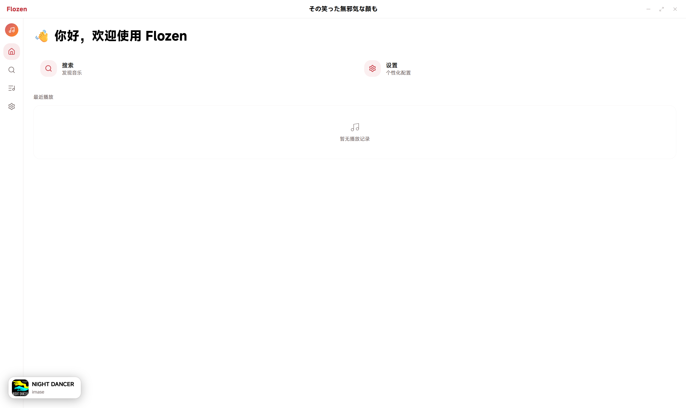
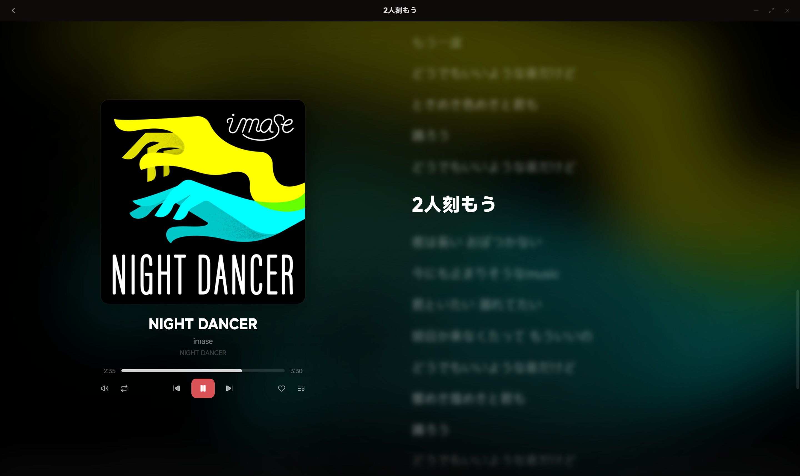

# Flozen

基于 **Tauri v2 + Vue 3** 的跨平台音乐播放器，适配 Windows、macOS、Android 与 iOS。支持多音乐平台模块化接入（目前仅支持网易云音乐）。

## 🖥 使用截图

<p align="center">
  
  
</p>

## ⚙️ 快速开始

### 前置依赖

- [Node.js](https://nodejs.org/) >= 18
- [Rust](https://www.rust-lang.org/)
- Windows 系统：[Microsoft Visual Studio C++ Build Tools](https://visualstudio.microsoft.com/visual-cpp-build-tools/)
- MacOS 系统：Xcode Command Line Tools
- 网易云音乐 API 服务（可选）

### 开发

```bash
npm install
npm run tauri dev
```

### 构建

```bash
npm install

# 构建前端
npm run build

# 构建 Tauri 桌面应用
npm run tauri build
```

## 📢 免责声明

为提供部分功能，Flozen 使用了网易云音乐的第三方 API 服务，**仅供个人学习使用，禁止商用或用于非法用途**。

Flozen 并非第三方音乐平台的官方客户端，且 Floze 及其开发者与任何音乐平台及其所归属公司**没有从属关系**。

Flozen 设计的目标是提供更加简洁的音乐客户端，开发者严格遵守相关法律法规，坚守版权意识。**使用者在使用本项目中造成的所有后果（包括但不限于音乐平台封号、限制）与可能产生的司法纠纷，与开发者无关，均由使用者自行承担。**

本项目承诺坚决不会提供音乐破解等**相关违法法规的功能**。**请遵守音乐平台的用户协议与相关规定。**

当您使用 Flozen 时，即代表您**同意并愿意遵守**该免责声明。

## 🙇‍♀️ 鸣谢

- [NeteaseCloudMusicApiEnhanced](https://github.com/neteasecloudmusicapienhanced/api-enhanced)
- [SPlayer](https://github.com/SPlayer-Dev/SPlayer)
- [Mineradio](https://github.com/XxHuberrr/Mineradio)

同时，程序使用了由小米公司主导制作的 [MiSans](https://hyperos.mi.com/font/) 作为主用字体。

## 🤖 AI 的使用

为提高开发效率，本程序大部分均由 AI 完成。

为保证质量，我们编写了 [**AGENTS.md**](AGENTS.md) 为 AI Agent 提供指引。

本程序在初步开发过程中，使用了 [Xiaomi MiMo-V2.5](https://mimo.xiaomi.com/zh/) 与 [DeepSeek V4 Pro](https://platform.deepseek.com/) 模型。

## 📃 许可证

本项目由 `Loaf Network` 维护，采用 [GPT-3.0](LICENSE) 许可证。

经由第三方平台获取的音乐，相关著作权均归原始著作权人享有。

与 `MiSans` 有关的所有权利归 [小米科技有限责任公司](https://www.mi.com/) 所有。